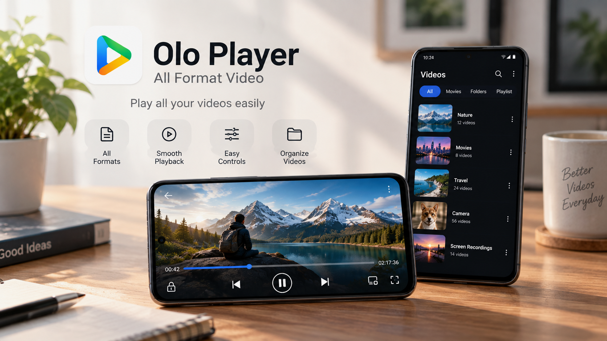

# Olo Player: All Format Video Player for Android 🎬🚀

**Olo Player** is a next-generation, hardware-accelerated HD and 4K video player engineered for Android. Built with a modern, bloat-free design, it combines studio-grade playback smoothness with a pioneering **Dual Subtitle** rendering engine, all without intrusive pop-up ads.

---

## 🌟 Why Olo Player?

Most mobile media players today are bloated with full-screen ads, heavy background telemetry, and sluggish codecs. **Olo Player** was built from the ground up to solve this:

- **⚡ Hardware-Accelerated 4K / 8K Playback:** Ultra-smooth 60fps rendering with low CPU and battery overhead.
- **🌐 Pioneering Dual Subtitle Engine:** Load and view two subtitle tracks simultaneously on screen—essential for bilingual movie watching and language learning.
- **🚫 Completely Ad-Free Experience:** No banners, no interstitial video ads, and no trackers disrupting your viewing.
- **🎧 Picture-in-Picture (PiP) & Background Audio:** Multitask seamlessly while listening to videos, lectures, or music.
- **👆 Intuitive Gesture Navigation:** Seamless swipe controls for volume, screen brightness, seeking, and aspect ratio zoom.

---

## 📱 Official Download

Get the latest verified build directly from the Google Play Store:

👉 **[Download Olo Player on Google Play](https://play.google.com/store/apps/details?id=com.oloplayer.olo_player)**

Official Product Page: **[DownloadKart Olo Player Hub](https://www.downloadkart.com/apps/olo-player-all-format-video)**

---

## 🚀 Key Feature Breakdown

### 1. Dual Subtitle Synchronizer
Display two subtitles simultaneously with customizable positioning, color palettes, fonts, and sizing. Perfect for:
- Watching anime with both Japanese & English subtitles
- Language learners studying foreign dialogues in real time
- Multilingual households

### 2. Universal Codec & Format Compatibility
Plays virtually any media file stored on your phone or SD card:
| Media Type | Supported Formats |
|---|---|
| **Video** | MKV, MP4, M4V, AVI, MOV, 3GP, FLV, WMV, RMVB, TS, WebM |
| **Audio** | AAC, MP3, WAV, FLAC, OGG, M4A, OPUS, AC3, DTS |
| **Subtitles** | SRT, VTT, ASS, SSA, SUB, Embedded MKV/MP4 Subtitle Tracks |

### 3. Smart Gestures & Controls
- **Left Screen Swipe:** Instant Brightness tuning
- **Right Screen Swipe:** Volume boost and control
- **Double Tap:** 10s Forward / Rewind
- **Pinch-to-Zoom:** Custom stretch, 16:9, 18:9, 4:3, or fit-to-screen
- **Playback Speed:** 0.25x slow motion up to 3.0x ultra-speed

### 4. Background & Floating Playback
- **Floating PiP:** Keep watching in a resizable window while texting or browsing.
- **Background Mode:** Plays audio even when the screen is locked, saving battery life.

### 5. Privacy & Offline-First
- **100% Offline Playback:** Works completely without an active internet connection.
- **No Unnecessary Permissions:** Requires only local storage access to index and play your media files.

---

## 🛠️ System Requirements

- **Operating System:** Android 8.0 (Oreo) and above (API Level 26+)
- **Architecture:** ARMv7, ARM64-v8a, x86_64
- **Storage:** ~25 MB installation size

---

## 🤝 Community, Issues & Support

Have an idea for a feature or found a playback issue with a specific video file?

- **Submit a Bug / Feature Request:** [Open an Issue](https://github.com/Nitesh87409/olo-player-android/issues)
- **Developer Website:** [DownloadKart](https://www.downloadkart.com)
- **Publisher Profile:** [Google Play Console](https://play.google.com/store/apps/details?id=com.oloplayer.olo_player)

---

## 📄 License & Distribution

Copyright © 2026 Olo Player / DownloadKart. All rights reserved.  
The Olo Player binary and application package are distributed as proprietary freeware via Google Play.
